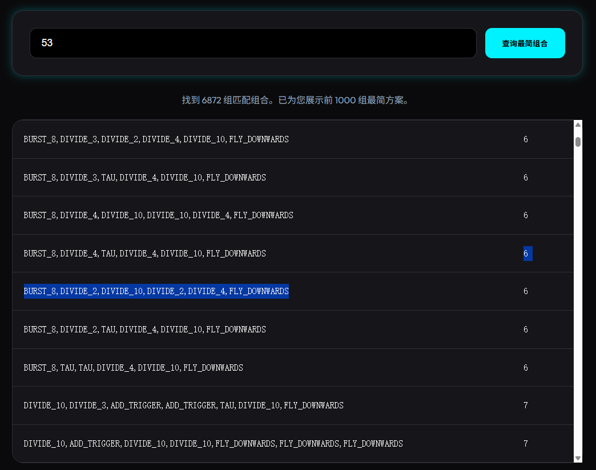

# Noita Wand Exhaustion Analytics
🔗 **[在线查询工具 (Live Tool)](https://asmallhamis.github.io/BURST_8-DIVIDE_10-DIVIDE_3-ADD_TRIGGER-DIVIDE_4-DIVIDE_2-TAU-FLY_DOWNWARDS/)**

本项目是一个针对游戏 *Noita*（女巫）中特定法术排列组合的全量穷举与查询工具。通过模拟引擎，我们计算了数百万种可能的魔杖配置与其产出的法术总量。

## 项目特性
- **海量数据**：涵盖 768 万种魔杖组合（1-8 槽位）。
- **极速查询**：采用“物理分片”技术，在不依赖后端服务器的情况下实现毫秒级数据检索。
- **最简优先**：查询结果自动按法术数量排序，帮助玩家找到最高效的魔杖配置。

## 数据生成与原理
本项目的数据由内置于 `tools/wand_eval_tree` 目录下的引擎生成。

### 1. 核心工具
如果你想复现本项目的数据或进行新的探索，可以使用以下工具：
- **`tools/wand_eval_tree/exhaust_wands.py`**: 魔杖全量穷举脚本。通过多进程调用 LuaJIT 模拟 Noita 法术系统。
- **`tools/wand_eval_tree/shard_csv.py`**: 数据分片脚本。将生成的巨量 CSV 数据切分为前端可加载的文本文件。
- **`tools/wand_eval_tree/main.lua`**: 支持 LuaJIT 的 Noita 魔杖环境模拟内核。

### 2. 原理解析
关于 A/D (Action/Draw) 追踪机制以及如何精准复刻原版 `gun.lua` 逻辑，请参考详细的开发笔记：
- 📄 **[AD_SOURCE_NOTES.md](tools/wand_eval_tree/AD_SOURCE_NOTES.md)**: 包含了对模拟引擎核心设计逻辑的解析。

### 3. 如何使用
1. 确保本地有 `Python 3.x` 环境和 `LuaJIT`。
2. 修改 `tools/wand_eval_tree/user_config.lua`，将 `noita_path` 和 `data_path` 填入你本地已提取的 Noita `data/` 目录路径。
3. 在 `exhaust_wands.py` 中确认 `LUAJIT_PATH` 指向你的 LuaJIT 可执行文件。
4. 运行 `python tools/wand_eval_tree/exhaust_wands.py` 开始生成。
5. 运行 `python tools/wand_eval_tree/shard_csv.py` 进行数据分片（输出到 `data/` 目录）。

## 关于法术回绕 (Spell Wrap)
在查询结果中，出现 `BURST_8` 的配置可能触发了 **法术回绕** 机制。
- **可能性**：并不是所有包含 `BURST_8` 的配方都会回绕。但通常排名靠前（长度较短）且含有 `BURST_8` 的配方大概率利用了回绕。
- **示例**：配置 `BURST_8, DIVIDE_2, DIVIDE_10, DIVIDE_2, DIVIDE_4, FLY_DOWNWARDS` 是一个成功触发回绕的典型案例。
  

## 本地运行
1. 进入项目目录。
2. 启动任意 HTTP 服务（例如 `python -m http.server 18000`）。
3. 通过浏览器访问相应端口即可进行交互式查询。

---

# Noita Wand Exhaustion Analytics (EN)
🔗 **[Live Tool (在线查询工具)](https://asmallhamis.github.io/BURST_8-DIVIDE_10-DIVIDE_3-ADD_TRIGGER-DIVIDE_4-DIVIDE_2-TAU-FLY_DOWNWARDS/)**

An exhaustive enumeration and query tool for specific wand spell combinations in the game *Noita*. Using an emulation engine, we have calculated millions of potential wand configurations and their total spell output.

## Features
- **Massive Data**: Covers 7.68 million wand combinations (1-8 slots).
- **Instant Query**: Uses "physical sharding" technology for millisecond-level data retrieval without a backend server.
- **Efficiency First**: Query results are automatically sorted by spell count.

## Data Generation & Principles
The data for this project is generated by the engine located in the `tools/wand_eval_tree` directory.

### 1. Core Tools
- **`tools/wand_eval_tree/exhaust_wands.py`**: Wand exhaustion script. Uses multi-processing and LuaJIT to simulate the Noita magic system.
- **`tools/wand_eval_tree/shard_csv.py`**: Data sharding script. Splits the massive CSV output into small chunks for the web frontend.
- **`tools/wand_eval_tree/main.lua`**: The Noita wand simulation core, optimized for LuaJIT.

### 2. Understanding the Logic
For details on the A/D (Action/Draw) tracking mechanism and how we hooked into `gun.lua`, see the development notes:
- 📄 **[AD_SOURCE_NOTES.md](tools/wand_eval_tree/AD_SOURCE_NOTES.md)**: Contains analysis and design documentation for the simulation engine core.

### 3. How to Use
1. Ensure you have `Python 3.x` and `LuaJIT` installed.
2. Modify `tools/wand_eval_tree/user_config.lua` to set `noita_path` and `data_path` to your extracted Noita `data/` directory.
3. Verify `LUAJIT_PATH` in `exhaust_wands.py` points to your LuaJIT executable.
4. Run `python tools/wand_eval_tree/exhaust_wands.py` to start generation.
5. Run `python tools/wand_eval_tree/shard_csv.py` for data sharding (output moves to `data/`).

## About Spell Wrap
Configurations featuring `BURST_8` may utilize the **Spell Wrap** mechanism.
- **Possibility**: Not all recipes involving `BURST_8` wrap. Shorter recipes containing `BURST_8` appearing early in search results are highly likely to have utilized wrapping.
- **Example**: `BURST_8, DIVIDE_2, DIVIDE_10, DIVIDE_2, DIVIDE_4, FLY_DOWNWARDS` is a verified successful wrap.
  

## How to Run Locally
1. Enter the project directory.
2. Start any HTTP server (e.g., `python -m http.server 18000`).
3. Access the browser for interactive queries.

---
## 致谢与致敬 (Credits)
核心枚举逻辑基于 [NathanSnail/wand_eval_tree](https://github.com/NathanSnail/wand_eval_tree) 开发。感谢其为 Noita 社区提供的高效模拟工具。
The core enumeration logic is based on [NathanSnail/wand_eval_tree](https://github.com/NathanSnail/wand_eval_tree). Thanks to the author for providing this efficient simulation tool to the Noita community.

## 许可协议 (License)
本项目及所使用的核心引擎均遵循 **GPL-3.0** 开源协议。
Both this project and its core engine follow the **GPL-3.0** open-source license.
详细条款请参阅 [LICENSE](LICENSE) 文件。 See the [LICENSE](LICENSE) file for details.
